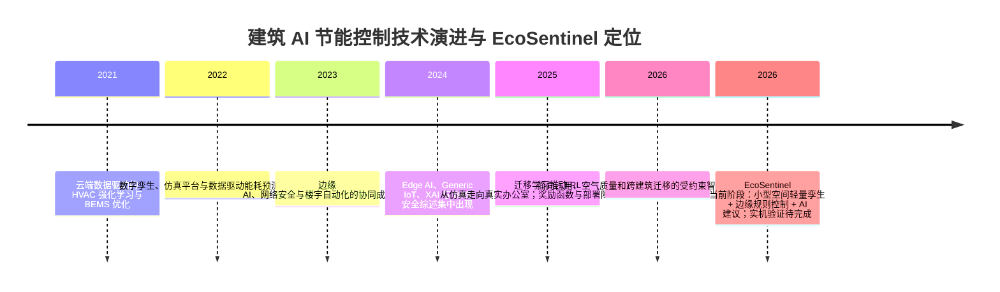

# EcoSentinel 环境监测与 AI 节能调控系统：近三年相关研究综述

> **用途**：本材料是《EcoSentinel 环境监测与 AI 节能调控系统》作品说明书第 2、8、9 章的补充材料，不替代项目自身实验报告。文中将项目结果严格标注为数字孪生仿真：3 天、300 s 步长、seed=42，baseline 为 199.10 kWh，saving 为 164.01 kWh，节电率 17.6%，平均舒适度 49.3%；该舒适度是项目仿真指标，不等同于 ASHRAE 55 标准符合率。**2026-10 更正**：此前的 81.48 / 57.18 kWh / 17.6% / 82.1% 来自热模型显式欧拉发散（dt=300s 超过稳定上限 2τ=27.8s）的无效结果，已按解析指数积分重算；同时建筑参数仍为**演示级未标定取值**，故该节能率只作内部一致性参考，不可与文献实测值直接比较。当前软件 P0–P11 重构、231 项测试与 CI 已通过，ESP32-S3 实机验证仍待完成。

## 一、总体判断

近三年的研究大致沿着“感知联网—边缘协同—数字孪生—强化学习—安全部署”推进。综述类研究普遍认为，IoT、边缘计算和 AI 能改善建筑能耗的可观测性与响应速度，但互操作、安全、数据质量和真实建筑部署仍是主要瓶颈。[Ożadowicz, 2024](https://doi.org/10.3390/computers13020045)；[Poyyamozhi et al., 2024](https://doi.org/10.3390/buildings14113446)；[Himeur et al., 2024](https://doi.org/10.1016/j.iot.2023.101035) EcoSentinel 的定位不是追求大规模建筑上的最高节电率，而是面向小型空间，验证一条“端—边—服务—可视化”的可追溯控制链：AI 负责建议，规则负责决策，安全边界负责执行与审计。

## 方向一：AIoT、边缘计算与建筑能效管理

### 1. 研究脉络

研究正从云端汇聚数据转向端—边—云分层：边缘节点承担低时延监测、协议适配和局部控制，云端更适合历史分析与跨建筑优化；但面向小型空间的轻量部署和离线保护仍缺少完整工程闭环。

### 2. 代表工作精简对比表

| 文献 | 年份 | 核心方法 | 平台/算力 | 节电率 | 舒适度 | 安全/可解释机制 | 与 EcoSentinel 对比定位 |
|:---|:---:|:---|:---|:---:|:---:|:---|:---|
| Ożadowicz, *Computers* | 2024 | Generic IoT、边缘/雾计算与楼宇自动化综述 | SoC/边缘节点—ICT 网络 | 未报告 | 未报告 | 讨论威胁、互操作与 SWOT | 支持 EcoSentinel 的端—边分层；该文为综述，不能与 17.6% 数值比较 |
| Poyyamozhi et al., *Buildings* | 2024 | IoT 智慧建筑能管系统综述 | 多传感器、联网 BEMS | 未形成统一实证值 | 未形成统一口径 | 将数据安全、集成复杂度列为障碍 | EcoSentinel 将“可观测性—能耗—控制—审计”落到小型空间原型；指标口径不同 |
| Himeur et al., *Internet of Things* | 2024 | Internet of Energy 的 Edge AI 挑战与展望 | 边缘 AI/能源物联网 | 未报告 | 未报告 | 关注隐私、通信、模型部署与可扩展性 | 支持边缘优先和离线保护；属于挑战综述，不能证明 EcoSentinel 的实测效果 |

### 3. 可融入说明书的论点

> **【插入第2章】** 建筑 AIoT 的关键不只是增加传感器，而是把低时延控制、数据治理和系统互操作纳入同一架构。[Ożadowicz, 2024]

> **【插入第8章】** EcoSentinel 的边缘优先设计回应了 Edge AI 对实时性、带宽和云端依赖的共同约束，但其节能效果仍需硬件实验验证。[Himeur et al., 2024]

## 方向二：数字孪生、HVAC 优化与强化学习部署

### 1. 研究脉络

研究已从“仿真中训练控制器”转向“校准数字孪生—迁移学习—真实建筑在线适配”，核心矛盾由算法性能转为模型偏差、探索风险和跨建筑迁移成本。

### 2. 代表工作精简对比表

| 文献 | 年份 | 核心方法 | 平台/算力 | 节电率 | 舒适度 | 安全/可解释机制 | 与 EcoSentinel 对比定位 |
|:---|:---:|:---|:---|:---:|:---:|:---|:---|
| Coraci et al., *Energy and Buildings*（HiLo） | 2025 | 仿真预训练、模仿学习与在线迁移的 SAC 控制器 | 校准数字孪生 + 两个真实办公室 | 报告不同场景约 6%–40%；场景、设备和基线不同 | 报告室温控制改善；未采用 EcoSentinel 的舒适度定义 | 重点是迁移部署，不是 AI—规则—执行器分权 | 若数值高于 17.6%，对方采用更复杂 HVAC/真实办公场景，算力与场景约束不同，不直接可比；与 EcoSentinel 均重视从仿真走向实机 |
| Kannari et al., *Journal of Building Engineering* | 2025 | 真实建筑 RL 控制与优化实施障碍综述 | 真实建筑部署视角 | 未给出统一节电率 | 强调舒适度与运行约束，但未统一数值 | 讨论安全、数据、组织和部署风险 | 为 EcoSentinel 的“先规则、后受约束学习”路线提供依据；属于综述 |
| Anik et al., SSRN 预印本 | 2025 | 数字孪生、多智能体与 HVAC 优化框架 | 高保真孪生 + 多智能体 | 未形成可核验统一实测值 | 目标包含舒适度，但未统一定义 | 强调自治智能体与预测维护，执行边界仍需工程化 | 属于预印本框架，不能作为已验证效果；EcoSentinel 以较轻量、可回退结构取舍复杂度 |

### 3. 可融入说明书的论点

> **【插入第9章】** 真实建筑 RL 的主要难点是迁移、数据、探索风险和运维责任，而非单纯提高仿真回报；因此实机校准应先于强化学习上线。[Kannari et al., 2025]

> **【插入第8章】** EcoSentinel 的 3 天确定性数字孪生适合作为策略筛选和回归测试环境，但不能替代真实建筑的交叉对照实验。[Coraci et al., 2025]

## 方向三：可解释 AI、安全约束与楼宇自动化

### 1. 研究脉络

研究重点从“模型是否准确”转向“自动化动作是否可解释、可审计、可拒绝”；对物理设备而言，解释文本不能替代动作白名单、范围检查、限频、故障回退和权限隔离。

### 2. 代表工作精简对比表

| 文献 | 年份 | 核心方法 | 平台/算力 | 节电率 | 舒适度 | 安全/可解释机制 | 与 EcoSentinel 对比定位 |
|:---|:---:|:---|:---|:---:|:---:|:---|:---|
| Breve, Cimino & Deufemia, *ACM TIST* | 2024 | 混合提示学习，为 IoT 触发—动作规则生成安全风险解释 | IFTTT 自动化规则与语言模型 | 不适用 | 不适用 | 生成隐私、物理和网络安全风险的事后解释 | 说明“可解释”可帮助审计，但 EcoSentinel 还必须保留命令编译器和执行隔离；该工作无建筑节能指标 |
| Dey et al., *IEEE TCSS* | 2024 | 面向人本、伦理 IoT 的 XAI 框架与安全讨论 | IoT 安全/入侵检测场景 | 不适用 | 不适用 | 强调透明性、用户参与和安全解释 | EcoSentinel 的审计日志与 AI 建议模式可作为工程化落点；任务域不同，不宜直接比较 |
| González et al., *Highlights in Computing and Communications* | 2024 | 楼宇自动化系统安全综述 | BAS/BMS 网络与控制系统 | 未报告 | 未报告 | 聚焦 BAS 攻击面、风险与防护 | 支持把越权、通信和执行器保护列为第9章后续工作；未提供节能或舒适度实证 |

### 3. 可融入说明书的论点

> **【插入第8章】** 在物理控制场景中，解释应与“谁能执行、执行什么、失败后如何回退”绑定，而不是只展示一段模型说明。[Breve et al., 2024]

> **【插入第9章】** EcoSentinel 当前的分权结构仍需通过命令白名单、参数范围、权限、限频和审计日志的实机测试来证明，而不能只停留在架构描述。[González et al., 2024]

## 方向四：强化学习 HVAC 的热舒适—能耗多目标权衡

### 1. 研究脉络

HVAC 强化学习已由单一能耗最小化转向能耗、热舒适、室内空气质量和设备寿命的多目标奖励设计；不同研究的舒适度定义和基线差异很大，跨论文直接比较节电率并不可靠。

### 2. 代表工作精简对比表

| 文献 | 年份 | 核心方法 | 平台/算力 | 节电率 | 舒适度 | 安全/可解释机制 | 与 EcoSentinel 对比定位 |
|:---|:---:|:---|:---|:---:|:---:|:---|:---|
| Al Sayed et al., *Journal of Building Engineering* | 2024 | HVAC 强化学习技术与概念综述 | 仿真、BMS 与 RL 平台 | 未统一 | 讨论热舒适奖励与约束，未统一数值 | 强调部署、状态/动作空间与奖励设计问题 | 为 EcoSentinel 后续受约束 RL 提供方法背景；综述本身无可直接对比结果 |
| Togashi, *Energy and Buildings* | 2025 | 对热舒适—能效奖励函数进行综述 | 多种 HVAC 仿真与实验研究 | 未形成单一结论 | 重点比较 PMV/PPD、温度区间等口径 | 奖励塑形可表达偏好，但不等于硬安全约束 | EcoSentinel 的 82.1% 只能与同定义指标比较；若对方使用 PMV/PPD，指标定义不同，不可数值对比 |
| Coraci et al., *Energy and Buildings* | 2025 | SAC + 迁移学习控制 TABS | 真实办公室 | 约 6%–40%，依场景而异 | 温度控制改善；非 EcoSentinel 百分比 | 迁移和在线微调，安全边界需结合现场系统 | 若节电率高于 17.6%，云/服务器训练和 TABS 场景约束不同，不直接可比；EcoSentinel 当前为离散规则仿真 |

### 3. 可融入说明书的论点

> **【插入第2章】** 节能率必须与基线、时段、设备和舒适度定义一起报告；脱离 PMV/PPD 或温度区间口径的单一百分比缺乏可比性。[Al Sayed et al., 2024]

> **【插入第9章】** 后续实验应同时记录温度、湿度、动作次数、功率和异常事件，并报告均值、方差、置信区间及舒适度定义，而非只保留一个节电率。[Kannari et al., 2025]

## 方向五：ESP32 低成本环境监测与能耗计量

### 1. 研究脉络

低成本微控制器研究已能完成环境量和电能数据的现场采集、无线传输与可视化，但“能测到”不等于“能用于控制”：计量校准、协议鲁棒性、断网续行和执行器安全决定其工程价值。

### 2. 代表工作精简对比表

| 文献 | 年份 | 核心方法 | 平台/算力 | 节电率 | 舒适度 | 安全/可解释机制 | 与 EcoSentinel 对比定位 |
|:---|:---:|:---|:---|:---:|:---:|:---|:---|
| El-Khozondar et al., *e-Prime* | 2024 | ESP32 采集电压、电流、功率和累计电能，实时推送 | ESP32 + Wi-Fi/Blynk | 未报告；重点为监测准确性与用户反馈 | 不适用 | 关注安全 Wi-Fi 与远程展示，未构成 HVAC 安全控制 | 支持 EcoSentinel 采用低成本边缘计量；EcoSentinel 进一步加入 JSONL 追溯、规则控制和离线保护 |
| Marini et al., IEEE EEEIC/ICPSEurope | 2024 | 基于 ESP32 的低成本无线传感器网络监测 BIPV 电压、电流和温度 | ESP32 无线节点 | 未报告 | 不适用 | 重点是低成本监测网络 | 与 EcoSentinel 同属低成本感知层；BIPV 场景与小型室内 HVAC 不同，不能比较节电率 |
| Halim et al., *Frontiers in Energy Research* | 2024 | 数字孪生、ESP32 电压/电流感知与智能电网负载管理 | ESP32 + 传感器 + IoT | 未报告统一建筑节电率 | 不适用 | 讨论安全、可持续性与效率，但非执行器分权控制 | 与 EcoSentinel 都把计量接入数字化闭环；EcoSentinel 的仿真规模更小，强调可复现和回退 |

### 3. 可融入说明书的论点

> **【插入第4章】** ESP32 适合承担传感、协议封装和轻量执行，但计量误差、通信中断和设备额定参数必须通过现场校准后才能支撑节能结论。[El-Khozondar et al., 2024]

> **【插入第9章】** EcoSentinel 的下一步不是简单增加传感器，而是完成电表校准、串口回放、Wi-Fi/MQTT 实测和多组 baseline/saving 交叉实验。[Marini et al., 2024]

## 二、研究演进时间线

## 三、代表性结论与开放问题

第一，EcoSentinel 的主要差异化不应表述为“节电率超过所有 RL 方法”，因为现有论文的建筑规模、HVAC 类型、训练算力、基线和舒适度定义并不一致。更稳妥的表述是：项目把低成本端侧采集、边缘离线控制、AI 建议隔离、故障回退和确定性实验记录组合成面向小型空间的可审计原型。

第二，项目最需要补齐的是实证闭环。后续应完成 ESP32 固件编译、传感器和电表校准、串口与网络异常回放，并在固定场景下进行不少于多组的 baseline/saving 交叉实验，报告功率、温湿度、舒适度定义、动作次数、异常数和统计不确定性。只有在此基础上，17.6% 才能与实测结果进行有边界的比较。

第三，控制安全仍是开放问题。未来可研究受约束离线强化学习、模型预测控制与规则控制的组合，但 AI 输出必须继续经过动作白名单、参数范围、权限、最小启停时间、限频和审计链；AI 超时、格式错误或连续失败时，应回退到本地规则或无动作状态。可解释性也应从“解释模型为何建议”扩展为“解释建议如何被约束、为何未执行、失败后为何回退”。

第四，舒适度需要标准化。项目当前 49.3% 是仿真评分，不能改写为 ASHRAE 55 符合率。后续可根据实测温湿度、辐射温度、风速、活动和衣着参数，选择明确的 PMV/PPD 或温度区间指标，并同时保留用户主观评价；不同定义不得混合进同一排名表。

## 四、引用文献清单（均可核验）

[1] Ożadowicz, A. Generic IoT for Smart Buildings and Field-Level Automation—Challenges, Threats, Approaches, and Solutions. *Computers*, 2024, 13(2):45. DOI: [10.3390/computers13020045](https://doi.org/10.3390/computers13020045).

[2] Poyyamozhi, M., Murugesan, B., Rajamanickam, N., Shorfuzzaman, M., & Aboelmagd, Y. IoT—A Promising Solution to Energy Management in Smart Buildings: A Systematic Review, Applications, Barriers, and Future Scope. *Buildings*, 2024, 14(11):3446. DOI: [10.3390/buildings14113446](https://doi.org/10.3390/buildings14113446).

[3] Himeur, Y., Sayed, A. N., Alsalemi, A., Bensaali, F., & Amira, A. Edge AI for Internet of Energy: Challenges and Perspectives. *Internet of Things*, 2024, 25:101035. DOI: [10.1016/j.iot.2023.101035](https://doi.org/10.1016/j.iot.2023.101035).

[4] Coraci, D., Silvestri, A., Razzano, G., Fop, D., Brandi, S., Borkowski, E., Hong, T., Schlueter, A., & Capozzoli, A. A Scalable Approach for Real-World Implementation of Deep Reinforcement Learning Controllers in Buildings Based on Online Transfer Learning: The HiLo Case Study. *Energy and Buildings*, 2025, 329:115254. DOI: [10.1016/j.enbuild.2024.115254](https://doi.org/10.1016/j.enbuild.2024.115254).

[5] Kannari, L., Wessberg, N., Hirvonen, S., Kantorovitch, J., & Paiho, S. Reinforcement Learning for Control and Optimization of Real Buildings: Identifying and Addressing Implementation Hurdles. *Journal of Building Engineering*, 2025, 104:112283. DOI: [10.1016/j.jobe.2025.112283](https://doi.org/10.1016/j.jobe.2025.112283).

[6] Anik, M. A., Wasi, A. T., Rahman, A., & Ahsan, M. M. A Digital Twin-Based Multi-Agent Framework for Understanding and Optimizing Smart Building HVAC Systems. *SSRN Electronic Journal*, 2025. DOI: [10.2139/ssrn.5212671](https://doi.org/10.2139/ssrn.5212671).（预印本，引用时应明确标注。）

[7] Breve, B., Cimino, G., & Deufemia, V. Hybrid Prompt Learning for Generating Justifications of Security Risks in Automation Rules. *ACM Transactions on Intelligent Systems and Technology*, 2024, 15(5):1–26. DOI: [10.1145/3675401](https://doi.org/10.1145/3675401).

[8] P. N. Mahalle, R. V. Patil, N. Dey, R. González Crespo, R. S. Sherratt, & N. A. P. Explainable AI for Human-Centric Ethical IoT Systems. *IEEE Transactions on Computational Social Systems*, 2024, 11(3):3407–3419. DOI: [10.1109/TCSS.2023.3330738](https://doi.org/10.1109/TCSS.2023.3330738).

[9] C. Morales-Gonzalez, M. Harper, M. Cash, L. Luo, Z. Ling, Q. Z. Sun, & X. Fu. On Building Automation System Security. *High-Confidence Computing*, 2024. DOI: [10.1016/j.hcc.2024.100236](https://doi.org/10.1016/j.hcc.2024.100236).

[10] Al Sayed, K., Boodi, A., Sadeghian Broujeny, R., & Beddiar, K. Reinforcement Learning for HVAC Control in Intelligent Buildings: A Technical and Conceptual Review. *Journal of Building Engineering*, 2024, 95:110085. DOI: [10.1016/j.jobe.2024.110085](https://doi.org/10.1016/j.jobe.2024.110085).

[11] Togashi, E. Reward Function Design in Reinforcement Learning for HVAC Control: A Review of Thermal Comfort and Energy Efficiency Trade-Offs. *Energy and Buildings*, 2025. DOI: [10.1016/j.enbuild.2025.116439](https://doi.org/10.1016/j.enbuild.2025.116439).

[12] El-Khozondar, H. J., Mtair, S. Y., Qoffa, K. O., Qasem, O. I., Munyarawi, A. H., Nassar, Y. F., Bayoumi, E. H. E., & Abd El Halim, A. A. A Smart Energy Monitoring System Using ESP32 Microcontroller. *e-Prime—Advances in Electrical Engineering, Electronics and Energy*, 2024, 9:100666. DOI: [10.1016/j.prime.2024.100666](https://doi.org/10.1016/j.prime.2024.100666).

[13] A. Laudani, F. Corti, M. Intravaia, G. M. Lozito, M. Quercio, & F. Riganti Fulginei. Monitoring of BIPV by Means of a Low Cost Wireless Sensor Network. *2024 IEEE International Conference on Environment and Electrical Engineering and 2024 IEEE Industrial and Commercial Power Systems Europe (EEEIC / I&CPS Europe)*, 2024. DOI: [10.1109/EEEIC/ICPSEurope61470.2024.10751001](https://doi.org/10.1109/EEEIC/ICPSEurope61470.2024.10751001).

[14] R. Alharbey, A. Shafiq, A. Daud, H. Dawood, A. Bukhari, & B. Alshemaimri. Digital Twin Technology for Enhanced Smart Grid Performance: Integrating Sustainability, Security, and Efficiency. *Frontiers in Energy Research*, 2024. DOI: [10.3389/fenrg.2024.1397748](https://doi.org/10.3389/fenrg.2024.1397748).

## 五、引用前的核验说明

本清单优先采用 DOI 可解析的期刊或会议论文；[6] 是 SSRN 预印本，不能与同行评审期刊等量齐观。表中“未报告”表示论文或检索到的正式摘要没有给出可与 EcoSentinel 直接对应的节电率/舒适度，并非推断其效果为零。引用清单已逐条按 DOI 元数据核对题名与作者；正式排版时可按学校要求转换为 GB/T 7714 格式。